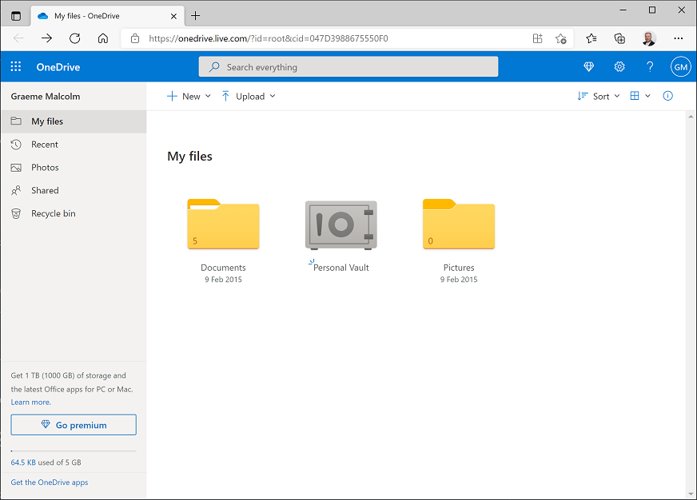
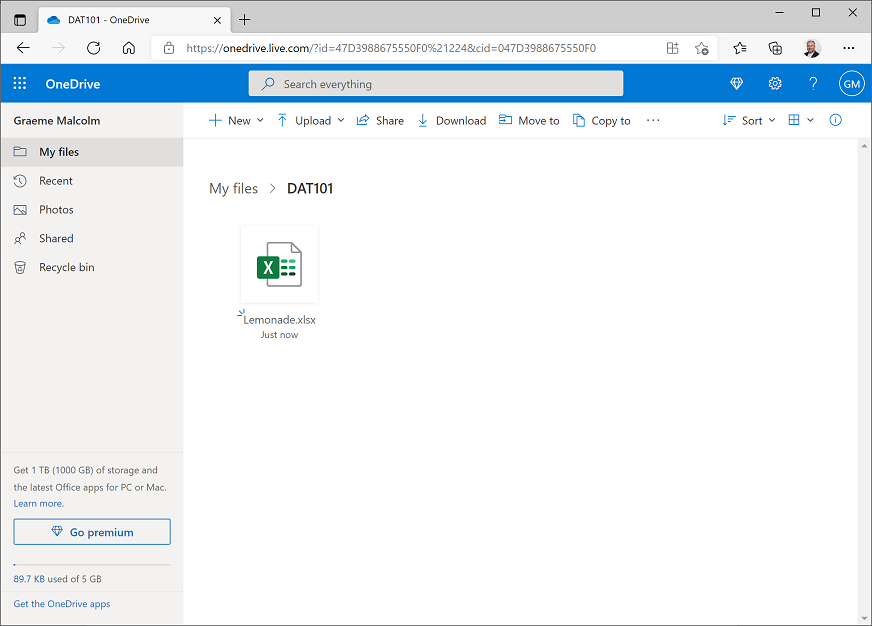

---
topic:
    module: ''
    title: 'Lab: Getting started with data'
---

# Lab: Getting started with data

OK, now it's your chance to get hands on with data. In this lab, you'll use Microsoft Excel Online to explore a simple dataset.

## Before you start

To complete the labs, you will need the following:

- A Windows, Linux, or Mac OS X computer with a web browser.
- A Microsoft account (for example a hotmail.com, live.com. or outlook.com account). If you do not already have a Microsoft account, sign up for one at <a href="https://signup.live.com" target="_blank" rel="noopener noreferrer">https://signup.live.com</a>.
- The lab files for this course. Download [the lab files archive](../DAT101x.zip), and extract it to a folder on your computer.

## Lab overview

Rosie Reeves is an entrepreneurial middle-school student who sells homemade lemonade from a stand at the park near her house. To promote her lemonade-stand, she distributes leaflets in the park. Rosie records details of her sales and flyer (leaflet) distribution, along with weather measurements including the temperature and rainfall each day.

In this lab, you will explore and visualize the data Rosie recorded.

## Exercise 1: Viewing a Table of Data in Excel

In this exercise, you will upload the Excel workbook containing Rosie’s data to the OneDrive cloud storage account associated with your Microsoft account, and then explore the data in Microsoft Excel Online.

### Upload the Workbook to OneDrive

1. In your web browser, navigate to <a href="https://onedrive.live.com" target="_blank" rel="noopener noreferrer">https://onedrive.live.com</a>, and sign in using your Microsoft account credentials. You should see the files and folders in your OneDrive, like this:

    

2. On the **&#65291; New** menu, click **Folder** to create a new folder. You can name this anything you like, for example **DAT101**.
3.	Click your new folder to open it, and then drag the **Lemonade.xlsx** Excel workbook file from the folder where you extracted the lab files for this course into the browser window to upload it to your folder. It should appear in your folder like this:

    

