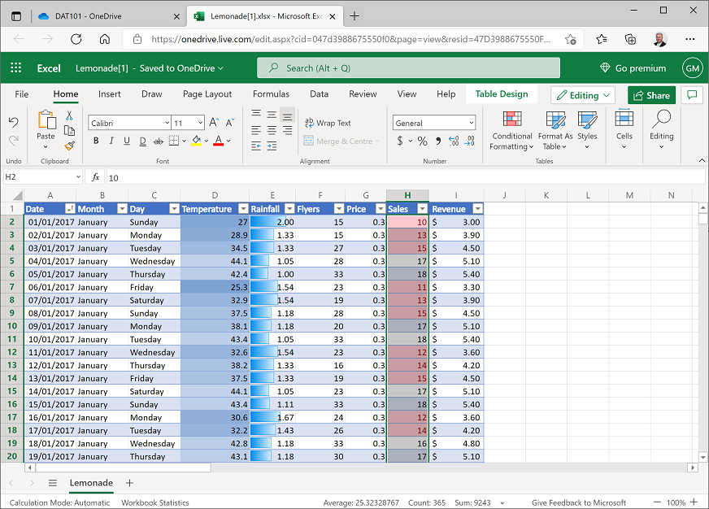

---
topic:
    module: ''
    title: 'Lab: Analyze data'
---

# Lab: Analyze data

Now let's put some of the data analysis principles amd techniques you've learned into action. In this lab you'll use Excel Online to analyze and visualize data.

## Before you start

Before starting this lab, complete the [Use Excel to explore data](./02-05-lab-explore-data.md) lab.

## Lab overview

In the previous lab, you explored a dataset containing details of Rosie's lemonade sales.

In this lab, you will analyze this data further, and create visualizations to help you gain insights from the data.

## Exercise 1: Analyzing data with a PivotTable

PivotTables are an excellent way to *slice and dice* data, summarizing numeric measures by one or more dimensions. In this exercise, you will use a PivotTable to view the lemonade data, aggregated in various ways.

### Create a PivotTable

1. If you have not already done so, in your web browser, navigate to <a href="https://onedrive.live.com" target="_blank" rel="noopener noreferrer">https://onedrive.live.com</a>, and sign in using your Microsoft account credentials. Then open the **Lemonade.xlsx** workbook in the folder where you uploaded it in the previous lab. Your workbook should look like this:

    

2. Select any cell in the table of data, and on the **Insert** tab of the ribbon, click **PivotTable**, and create a PivotTable from your table of data in a new worksheet. Excel adds a new worksheet with a PivotTable that looks like this:

    

3. In the **PivotTable Fields** pane, select **Month**. Excel automatically adds **Month** to the **Rows** area of the PivotTable and displays the month names in chronological order.
4. In the **PivotTable Fields** pane, select **Sales**. Excel automatically adds **Sum of Sales** to the **Values** area of the PivotTable and displays the total number (sum) of lemonade sales for each month, like this:

    

    You can now see the sales aggregated by month – so for example, there were 1,056 sales in June.

### Add a second dimension

1. In the **PivotTable** Fields pane, select **Day**. Excel automatically adds **Day** to the **Rows** area of the PivotTable and displays the total number (sum) of lemonade sales for each weekday within each month, like this:

    

    Now you can see monthly sales aggregated by weekday. For example, 57 of the sales in January were made on a Saturday. You can also expand/collapse months to *drill-up*/*drill-down* the levels of the hierarchy.

2. In the **PivotTable Fields** pane, drag **Day** from the **Rows** area to the **Columns** area. Excel now shows total sales for each month on rows, broken down by weekday in columns; like this:

    

    You can still see monthly sales broken down by weekday, but you can also see (in the bottom row) the totals for each week day across the entire year. For example, a total of 1,324 sales were made on a Monday.

### Change the aggregation

1. In the **PivotTable Fields** pane, in the **Values** area, click the drop-down arrow next to **Sum of Sales**, and then click **Value Field Settings**.
2. In the **Value Field Settings** dialog box, select **Average** as shown here:

    

    The table of data now shows the average number of sales for each month and weekday, as shown here:

    
 
    You can now see the average number of sales for each weekday by month. For example, the average number of sales on a Wednesday in February is 19.75.

### Challenge: PivotTable analysis

1. Modify the fields in the PivotTable to find the following information:
    - The total sum of revenue for August.
    - The temperature on the hottest Saturday in July.
    - The lowest number of flyers distributed in a day during November.

## Exercise 2: Visualizing data with charts

It can often be easier to identify trends and relationships in data by creating data visualizations such as charts.

### View the sales trend for the year

1. Modify the PivotTable you created in the previous exercise so that it shows **Date** in the **Rows** area and the sum of **Sales** and sum of **Temperature** (in that order) in the **Values** area, like this:

    

    Make sure your table looks like the one shown, before you proceed (note that the date may be formatted differently for your location).

2. Select the cells containing the date, daily sales, and temperature values only, but **<u>not</u>** the **Date**, **Sum of Sales**, and **Sum of Temperature** header cells or the **Grand Total** footer cells; and then on the **Home** tab of the ribbon, click the **Copy** button (&#128464;) to copy the selected cells to the clipboard.
3. Under the worksheet, click the **New Sheet** button (**+**) to add a new worksheet to the workbook.
4. In the new sheet, select cell **A2**, and then on the **Home** tab click the **Paste** button (&#128203;) to paste the copied cells into the new worksheet. You may need to widen the **A** column to see the dates.
5. In cells **A1** to **C1**, add the columns headers **Date**, **Sales**, and **Temperature**. Your new worksheet should look like this:

    

6. Select the **Date** and **Sales** data, including the headers (but <u>not</u> the temperature data). Then on the **Insert** tab of the ribbon, in the **Line** drop-down list, click the first line chart format. Excel inserts a line chart like this:

    

    Note that the line chart shows daily fluctuations in sales, but the general trend seems to indicate that sales are higher during the summer months and lower at the beginning and end of the year.

7. Delete the chart, and then select all the data and headers, including **Temperature** and insert a new line chart. This inserts a chart like this:

    

    This time, the chart includes separate series for **Sales** and **Temperature**. Both series show a similar pattern; it seems sales and temperature both increase over the summer months.

8. Select the chart and double-click the chart title. Then in the **Chart** pane on the **Format** tab, expand **Chart Title** and change the chart title to *Sales and Temperature*:

    

9. Close the **Chart** pane.

### View revenue by weekday

1. Return to the worksheet containing the PivotTable, and modify it to show **Day** on rows with the *average* of **Revenue**. Your result should look like this although your days of the week may not be ordered:

    

2. Copy the day and average revenue values (but <u>not</u> the headers or total) to the clipboard, and then add a new worksheet, paste the copied data in cell **A2**, and add **Day** and **AverageRevenue** headers like this:

    

3. Select the **B** column header and on the **Home** ribbon tab, use the **\$** menu to format the revenue data as **\$ English (United States)**, like this:

    

4. Select all the data, including the **Day** and **AverageRevenue** headers, and on the **Insert** tab of the ribbon, in the **Column** drop-down list, select the first column chart format. A chart like this is created:

    

    At first glance this chart appears to show some significant variation between average revenue of different days of the week; with revenue on Thursdays much higher than on Sundays. However, look more closely at the scale on the vertical (Y) axis – The difference is less than 30 cents.

5. Select the column chart, and on the **Chart** tab of the ribbon, in the **Pie** drop-down list select the **2D Pie chart** format. The chart changes to a pie chart like this:

    

    Note that the pie segments are more or less the same size for each day.

6. Select the pie chart and on the **Chart** tab, in the **Data Labels** drop-down list, select **Inside End**. This displays the actual data amounts in the chart, like this:

    

    Now it’s clearer that there’s little apparent variation in average revenue for different days of the week.

### View sales by flyers

1. Return to the worksheet containing the PivotTable, and modify it to show **Date** on rows with the sum of **Flyers** and the sum of **Sales**, like this:

    

2. Copy the date, flyers, and sales values (but <u>not</u> the headers or totals) to a new worksheet and add **Date**, **Flyers**, and **Sales** headers like this:

    

3. Select the **Flyers** and **Sales** data and headers (but not the dates). Then on the **Insert** tab, in the **Scatter** drop-down list, select the first scatter-plot format. This creates a scatter-plot chart like this:

    

    Note that the chart shows the number of flyers distributed each day on the horizontal (X) axis, and the number of sales each day on the vertical (Y) axis. The plot forms a roughly diagonal line (with some variance), indicating a general trend where the number of sales tends to increase in-line with the number of flyers distributed.

### View sales by rainfall

1. Return to the worksheet containing the PivotTable, and modify it to show **Date** on rows with the sum of **Rainfall** and the sum of **Sales** as values, like this:

    

2. Copy the date, rainfall, and sales values (but <u>not</u> the headers or totals) to a new worksheet and add **Date**, **Rainfall**, and **Sales** headers like this:

    
 
3. Select the **Rainfall** and **Sales** data and headers (but <u>not</u> the dates). Then on the **Insert** tab, in the **Scatter** drop-down list, select the first scatter-plot format. This creates a scatter-plot chart like this:

    
 
    This plot seems to indicate some kind of relationship between rainfall and sales, with sales falling as rainfall increases. However, the line formed by the plots is curved. This often means there is a non-linear, possibly logarithmic relationship.

4. Delete the chart so you can see the empty **D** and **E** columns after the daily rainfall and sales data.
5. In **D1**, add the column header **LogRainfall**, and then select cell **D2** and enter the following formula in the ***fx*** box above the worksheet to calculate the base 10 log of the rainfall value:

    ```
    =log(B2)
    ```

6. Copy the formula to the other cells in the **LogRainfall** column. The easiest way to do this is to select the cell containing the formula and double-click on the small square "handle" (**&#9642;**) at the bottom right of the selected cell.
7. In **E1**, add the column header **LogSales**, and and then select cell **E2** and enter the following formula in the ***fx*** box above the worksheet to calculate the base 10 log of the sales value:

    ```
    =log(C2)
    ```

8. Copy the formula to the other cells in the **LogSales** column. 
9. Select the **LogRainfall** and **LogSales** data and headers. Then on the **Insert** tab, in the **Scatter** drop-down list, select the first scatter-plot format. This creates a scatter-plot chart like this:

    
 
    Note that this plot shows a linear relationship between the log of rainfall and the log of sales. This is potentially useful as we explore relationships in the data, as it is easier to calculate a linear equation that relates rainfall to sales than to define a logarithmic equation to do the same.

### Challenge: Visualizing data

1. Create a column chart showing the sum of flyers distributed on each day of the week and note the days on which the highest and lowest number of flyers were distributed.
2. Create a scatter plot showing daily temperature and rainfall and examine the apparent relationship between these fields.

[< Back](./03-03-visualize-data.md) | [Next >](./04-00-statistics.md)