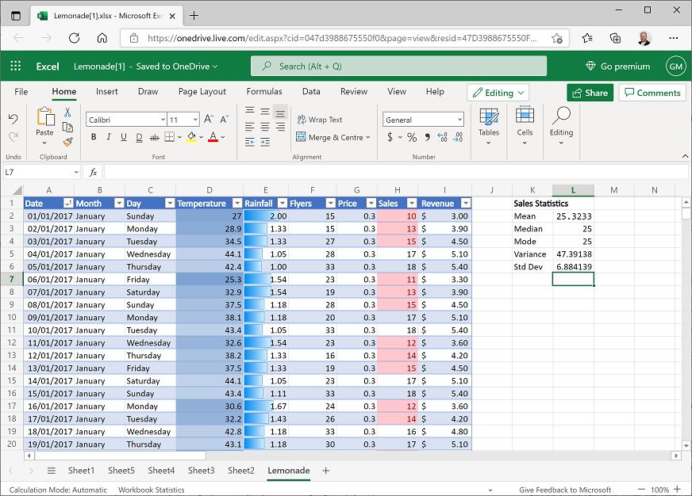

---
topic:
    module: ''
    title: 'Lab: Explore statistical analysis'
---

# Lab: Explore statistical analysis

Let's try some hands-on statistical analysis using Excel Online.

## Before you start

Before starting this lab, complete the [Use Excel to explore data](./02-05-lab-explore-data.md) and [Analyze data](03-04-lab-analyze-data.md) labs.

## Lab overview

In the previous labs, you explored a dataset containing details of Rosie's lemonade sales.

In this lab, you will apply some statistical analysis techniques to uncover deeper insights into the data.

## Exercise 1: Using descriptive statistics

Descriptive Statistics help you understand the "shape" or *distribution* of your data; for example, by finding measures on central tendency (the most common "typical" values) and measures of variance (how much difference there is between the most common values and other values that are higher or lower).

### Calculate descriptive statistics for sales

1. If you have not already done so, in your web browser, navigate to <a href="https://onedrive.live.com" target="_blank" rel="noopener noreferrer">https://onedrive.live.com</a>, and sign in using your Microsoft account credentials. Then open the **Lemonade.xlsx** workbook in the folder where you uploaded it in the previous labs and view the **Lemonade** worksheet. Your workbook should look like this:

    

2. In cell **K1**, enter the text **Sales Statistics**, and format it as bold.
3. In cell **K2**, enter the text **Mean**, and then select cell **L2**, and enter the following formula in the ***fx*** bar:

    ```
    =AVERAGE(H2:H366)
    ```

    This calculates the arithmetic mean for sales, which should be slightly over 25.3.

4. In cell **K3**, enter the text **Median**, and then select cell **L3** and enter the following formula:

    ```
    =MEDIAN(H2:H366)
    ```

    This calculates the median for sales, which should be 25.

5. In cell **K4**, enter the text **Mode**, and then select cell **L4** and enter the following formula:

    ```
    =MODE.SNGL(H2:H366)
    ```

    This calculates the mode for sales, which should also be 25.

6. In cell **K5**, enter the text **Variance**, and then select cell **L5** and enter the following formula:

    ```
    =VAR.P(H2:H366)
    ```

    This calculates the variance for sales, which should be slightly over 47.39.

    *Note that the formula for variance in this case applies to the full population of data, hence the .P extension in the function name – you’ll explore working with data samples later in this lab.*

7. In cell **K6**, enter the text **Std Dev**, and then select cell **L6** and enter the following formula:

    ```
    =STDEV.P(H2:H366)
    ```

    This calculates the standard deviation for sales, which should be slightly over 6.88. 

    *Note once again that the formula for standard deviation in this case applies to the full population of data.*

    Your worksheet should now look like this:

     
 
    The statistics you have calculated tell you something about the distribution of the sales values, but it can often be easier to visualize the data to get a sense of how the data is distributed.

### Visualize the distribution of sales values

1. Select all the data in the **Sales** column, including the header. Then on the **Insert** tab of the ribbon, in the Other Charts drop-down list, click the Histogram chart (which is the first one in the **Statistical** section).
2. Select the chart that is produced and edit the chart title to change it to **Sales**. Then move the chart so that it is to the right of the statistics you calculated in the previous exercise. The chart should look like this:

     
 
3. Examine the chart, and note the following:
    - The histogram shows the frequency of different values for **Sales** values grouped into ranges, or *bins*. For example, there are around 15 days with a **Sales** value between 10.4 and 13.8; and there are around 20 days with a **Sales** value between 34.2 and 37.6.
    - The most frequently occurring **Sales** values are between 24 and 27.5. This range includes the mean, median, and mode statistics you calculated previously. In other words, on most days, the number of sales was more or less in the middle of the lowest and highest selling days.
    - The distribution is approximately symmetrical around the middle values, forming a "bell-shaped curve" that tapers evenly towards the ends; where there are few occurrences of extreme values for **Sales**. Statisticians refer to this kind of distribution as a *normal* distribution.
    - The standard deviation you calculated previously is just under 6.9. This statistic provides a standard unit of variance around the mean (which is just over 25.3). The data within 1 standard deviation above or below the mean) therefore includes values from approximately 18.4 to around 32.2, as shown here:
 
        

        In a normal distribution, around 68.26% of the data falls within a single standard deviation; so in this case, the number of sales was between 18.4 and 32.2 on 68.26% of the days. Around 95.45% of values fall within 2 standard deviations in a normal distribution, so there were between 11.5 and 39.1 sales on 95.4% of days.

4. Select all the data in the **Sales** column, including the header. Then on the **Insert** tab of the ribbon, in the **Other Charts** drop-down list, click the **Box and Whisker** chart (which is the third one in the **Statistical** section).
5. Select the chart that is produced and edit the chart title to change it to **Sales**. Then move the chart so that it is to the right of the histogram you created previously. The chart should look like this:

    
 
6. Examine the chart, and note the following:
    - The horizontal line in the middle indicates the median value for sales. This is the 50% percentile – in other words, 50% of the values are higher than this, and 50% are lower.
    - The X in the box indicates the mean – this is only slightly higher than the median.
    - The filled box indicates the range of values in the second and third quartiles – in other words, from the 25th percentile to the 75th percentile. These values range from around 20 to 30, indicating that the number of sales on half of the days was within this range, 
    - The lines extending from the box (known as whiskers) show the range for the first and fourth quartiles, on which there were more or fewer sales than in the second and third quartiles.

### Analyze statistics for rainfall

1. Leave some space under the existing statistics, and in cell K17, enter the text **Rainfall Statistics**, and format it as bold.
2. In cell **K18**, enter the text **Mean**, and then select cell **L18** and enter the following formula:

    ```
    =AVERAGE(E2:E366)
    ```

    This calculates the arithmetic mean for rainfall, which should be 0.83.

3. In cells **K19** to **L22**, calculate the median, mode, population variance, and population standard deviation for rainfall, in the same way you did for sales previously. When you’re finished, your worksheet should look like this:

    

    Note that the mean rainfall is quite a bit higher than the median and mode.

4. Create a histogram of rainfall, and then add an appropriate chart title and move the chart to the right of the rainfall statistics. The rainfall histogram should look like this:

    

5. Examine the histogram and note that the distribution of the rainfall data is not *normal*.

    The median value is around 0.74, so on half the days there was less rain than this, and on half there was more; however, on a rare few days, there was much more rain than this - as much as 2.42 to 2.55. These infrequent days of extremely high rainfall are skewing the distribution by "pulling" the mean to the right. This results in a long tail of infrequently occurring values that tapers towards the right. We therefore refer to this as a right-skewed distribution (had the tail pulled the mean to the left, it would be a left-skewed distribution).

6. Create a box and whisker chart of rainfall with an appropriate title; and move it to the right of the rainfall histogram. The box and whisker chart should look like this:

    

7. Examine the chart and note the following:
    - The line indicating the median (50th percentile) noticeably lower than the X indicating the mean.
    - The filled box, representing the 2nd and 3rd quartiles represents 50% of the data – in other words, on half of the days, the rainfall was between around 0.6 and 0.8.
    - The dots indicate outliers; rare values that are considered extreme compared to the typical range of values, which lies within the whiskers.
    - Even discounting the outliers, the range of values in the 4th quartile is larger than that of the other quartiles.

### Challenge: Analyze temperature statistics

1. Calculate the mean, median, mode, population variance, and population standard deviation of temperature.
2. Create a histogram and a box and whiskers chart for temperature to visualize the distribution.

## Exercise 2: Working with Samples

Until now, we’ve worked with the full population of data – in other words, we had all of Rosie’s lemonade sales data to work with. In reality, it’s more usual to work with a sample of data. For example, suppose you needed to conduct some research to determine the most common eye color in the US. It would be unrealistic to examine the eyes of every person in the US, so you would approach this problem by surveying a representative sample of people, and use the statistics collected as approximations for the full population parameters.

### Create a random sample

1. On the **Lemonade** worksheet, select in cell **A1** and then press **CTRL+A** (**&#8984;** + A on Mac OSX) to select the entire table of lemonade sales data. Then on the **Home** tab of the ribbon, click **Copy**.
2. Add a new worksheet to the workbook and click cell **A1** of the new worksheet. Then on **Home** tab of the ribbon, click **Paste** to paste the copied table into the new worksheet (this may take a few seconds).
3. Click cell **A1** (the **Date** header), and then on the **Home** tab of the ribbon, in the **Cells** section, click the **Insert** drop-down list and select **Insert Table Columns to the Left**. This inserts a new column for a table field named **Column1**.
4. In the new cell **A1**, rename **Column1** to **RandomID**, and then select column **A** and in the format drop-down list in the **Number** section of the **Home** tab of the ribbon (which should currently have **General** selected), click **Number**.
5. In cell A2, enter the following formula:

    ```
    =RAND()
    ```

    This will generate random numbers in the RandomID column.

6. Click the drop-down arrow in the **RandomID** column header and click **Sort Smallest to Largest**. The data in the table is sorted by the **RandomID** field, which randomizes the order of the data records. This makes it easier to select a random sample of records (a random sample is more likely to be representative of the population than a sample that is based on some inherent order in the data itself). Your worksheet should now look like this:

    
 
7. In Cell **M1**, enter the text **Mean Rain**, and in cell **N1** enter the text **Rain StDev**.
8. In cell **L2**, enter the text **Population**.
9. Select cell **M2** and enter the following formula:

    ```
    =AVERAGE(F2:F366)
    ```

10.	Select cell **N2** and enter the following formula:

    ```
    =STDEV.P(F2:F366)
    ```

    This gives you full population parameters for the mean and standard deviation of rainfall, so you can compare them with sample statistics.

    Your workbook should now look like this:

    
 
11. In cell **L3**, enter the text **Sample1**.
12. Select cell **M3** and enter the following formula:

    ```
    =AVERAGE(F2:F41)
    ```

13.	Select cell **N3** and enter the following formula:

    ```
    =STDEV.S(F2:F41)
    ```

    This gives you sample statistics for the mean and standard deviation of rainfall based on the first 40 random rows of data. Note that you use the same AVERAGE function to calculate a sample mean or population mean, but you use the STDEV.S function to calculate the standard deviation for a sample – this incorporates some additional variance to allow for sample bias. Your spreadsheet should now look similar to this (the figures may not be exactly the same because of the randomization of the data):

    
 
    Compare the sample statistics with the population parameters.

14. In cell **L4**, enter the text **Sample2**.
15. Select cell **M4** and enter the following formula:

    ```
    =AVERAGE(F35:F74)
    ```

16.	Select cell **N4** and enter the following formula:

    ```
    =STDEV.S(F35:F74)
    ```

This produces statistics from a different sample. Note that the closeness of the sample statistics to the population parameters varies depending on the sample. In this case, both samples include 40 observations - using larger samples generally results in statistics that are closer to their actual population parameters.

## Create a sampling distribution

1. Select cells **L3** to **N4** (the **Sample1** and **Sample2** statistics you created previously; but not the population parameters), and then drag the small square handle (**&#9642;**) at the bottom right of the selected cells down to row 292. This creates 290 samples as shown here:

    
 
    The means of the samples form a sampling distribution of the mean – in other words, a new data distribution that consists of the sample means.

2. In cell **O1**, enter the text **Sampling Mean**. Then select cell **O2**and enter the following formula:

    ```
    =AVERAGE(M3:M292)
    ```

    This calculates the mean of the sample means; in other words, the mean of the sampling distribution. This should be fairly close to the population mean as shown here (yours may not be exactly the same as the population mean, but it should be close!)

3. Select cell **M3** (the **Sample1** mean) and then hold the Shift and Ctrl keys and press the Down-Arrow key to select all the other sample means (if you are using a Mac OSX computer, hold the Shift and **&#8984;** keys, and press the Down-Arrow key).
4. In the **Insert** tab of the ribbon, in the **Other Charts** drop-down list, select **Histogram** (the first chart in the **Statistical** section) and view the histogram that is created, as shown here (your chart may look a little different):

    
 
    The histogram may not look exactly symmetrical; but when you create a sampling distribution from a sufficiently large number of reasonably-sized samples, you’ll find that it has a bell-curved appearance. We won’t discuss this any further in this course, but it’s useful to know that with enough random samples, a sampling distribution generally takes on a normal distribution due to something called the central limit theorem – even when (as in this case), the population data from which the sample means are derived is not normally distributed.

### Challenge: Analyze temperature samples

1. Create a sampling distribution based on 290 samples of mean Temperature. Each sample should be based on 40 random observations.
2. Calculate the mean of the temperature sampling distribution.
