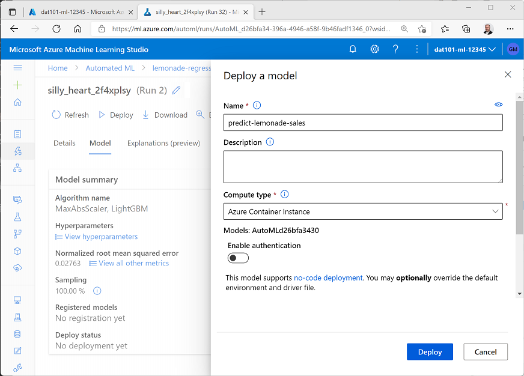

---
topic:
    module: ''
    title: 'Lab: Get started with machine learning'
---

# Lab: Get started with machine learning

In this lab, you'll explore *Azure Machine Learning*, a cloud-based service for training and managing machine learning models. Specifically, you'll use the *Automated machine learning* capabilities of the service to train a model using existing data.

## Before you start

Before starting this lab, you'll need a Microsoft Azure subscription.

If you don't already have an Azure subscription, sign up for a free trial using your Microsoft account at <a href="https://azure.microsoft.com/free/" target="_blank" rel="noopener noreferrer">https://azure.microsoft.com/free</a>.

## Lab overview

Rosie Reeves has been selling lemonade for a while, and has collected data for each day on which she sold lemonade. Now she wants to use that data to create a model that will predict how much lemonade she is likely to sell on a given day, which will help her ensure that she makes the right amount of lemonade to meet demand.

## Exercise 1: Prepare Azure Machine Learning resources

Before you can use Azure Machine learning to train and test a predictive model, you need to prepare a few resources in your Azure subscription.

### Create an Azure Machine Learning workspace

As its name suggests, a workspace is a centralized place to manage all of the Azure ML assets you need to work on a machine learning project.

1. Sign into the the <a href="https://portal.azure.com" target="_blank" rel="noopener noreferrer">Azure portal</a> and on the **Home** page, click the **&#65291; Create a resource** button and search for *Machine Learning*. Then create a new **Machine Learning** resource, specifying the following settings:

    - **Subscription**: *Your Azure subscription*
    - **Resource group**: *Create a resource group with a suitable name, such as **azure-ml-resources***
    - **Workspace name**: *Enter a unique name for your workspace*
    - **Region**: *Select the geographical region closest to you*
    - **Storage account**: *Note the default new storage account that will be created for your workspace*
    - **Key vault**: *Note the default new key vault that will be created for your workspace*
    - **Application insights**: *Note the default new application insights resource that will be created for your workspace*
    - **Container registry**: None

    

2. Click **Review + create** to validate the settings for your workspace, and then click **Create** to create it. Deployment of the new workspace may take a minute or so.
3. When the workspace and its associated resources have been deployed, use the **Go to resource** button to view the deployed workspace, which should look like this:

    

### Use Azure Machine Learning to train a regression model

Now that you have created an Azure Machine Learning workspace, you can use Azure Machine Learning to train a machine learning model. Specifically, you are going to use the *Azure Machine Learning Studio* web-based interface to run an *Automated Machine Learning* job that applies multiple machine learning algorithms to your data to find the best-performing predictive model.

1. In the Azure portal, on the page for your Azure Machine Learning workspace, click **Launch studio**. This open Azure Machine Learning Studio in a new browser tab. (If prompted, sign in using the Microsoft account you used in the previous task and select your Azure subscription and workspace.)

    

2. On the home page in Azure Machine Learning studio, under **Automated ML**, click **Start now**.
3. On the **Automated ML** page, click **&#65291; New Automated ML run**.
4. On the **Select dataset** step, in the **&#65291; Create dataset** list, select **From web files**:

    

5. On the **basic info** page, enter the following information and then click **Next**:
    - **Web URL**: `https://raw.githubusercontent.com/GraemeMalcolm/dat101/master/labfiles/Lemonade.csv`
    - **Name**: lemonade
    - **Dataset type**: tabular
    - **Description**: Lemonade sales data
    - **Skip data validation**: Unelected

    

6. On the **Settings and preview** page, review the preview of the dataset, which consists of daily records of lemonade sales.

    

7. Click **Next**, and on the **Schema** page, review the data types identfied for the lemonade data fields, and then click **Next**:

    

8. On the **Confirm details** page, click **Create** to create the dataset.
9. Back on the **Select dataset** step, click **&#8635; Refresh** until the **lemonade** dataset is listed. Then select it, and click **Next**:

    

10. On the **Configure run** step, enter the following details:
    - **Experiment name**: *Create a new experiment named **lemonade-regression***
    - **Target column**: Sales
    - **Select compute cluster**: Create a new compute

    

11. On the **Create compute cluster** page, select the location nearest you, and then in the list of recommended virtual machine options, select **Standard_DS11_V2**. This defines a compute cluster that will be used to run the automated machine learning training job.

    

12. Click **Next**. Then, on the **Configure settings** page, enter the following settings for your compute cluster and click ****Create**:
    - **Compute name**: *enter a unique name*
    - **Minimum number of nodes**: 0
    - **Maximum number of nodes**: 1
    - **Idle seconds before scale down**: 60

    

13. Wait for the compute cluster to be created. This may take a minute or so.
14. Back on the **Configure run** step, ensure your new compute cluster is selected and click **Next**.

    

15. On the **select task type** step, select **Regression**.

    

16. With **Regression** selected, click **View additional configuration settings** and in the **Exit criterion** section, set the **Metric score threshold** to **0.05** as shown below and click **Save**. This will cause the automated ML training job to end as soon as a model is trained that achieves a score of 0.05 or better for the metric used to measure predictive performance (in this case, *normalized root mean squared error*).

    

17. Click **Finish** and wait for the Automated ML run to start, and note that it is assigned a unique name.

    

18. Wait for the run to complete - this may take several minutes as the run starts the compute, performs data featurization, and then iteratively trains multiple models based on different algorithms until one is produced that matches or exceeds the exit criteria.

### Deploy the best model

After a model has been trained, you can deploy it and use it from applications to predict daily sales based on factors such as day of the week, month of the year, weather conditions, and flyers distributed.

1. When training has completed, click the algorithm name in the **Best model summary** section.

    

2. In the page for the best model, click **&#9655; Deploy**.

    

3. In the **Deploy model** pane, enter the following details and click **Deploy**:
    - **Name**: predict-lemonade-sales
    - **Description** *leave blank*
    - **Compute type**: Azure Container Instance
    - **Enable authentication**: Unselected

    

4. Wait for the model to deploy, monitoring the **Deploy status** until it changes from **Running** to **Succeeded** (this may take a while - you can click **&#8635; Refresh** to check for updated status).

    

5. To view the deployed endpoint, click **predict-lemonade-sales** under **Deploy status**, and verify that it has a **Deployment state** of **Healthy**.

    

### Test the deployed model

Now that you've deployed the model to a web service endpoint, you can test it by submitting new data for a day and predicting the number of lemonade sales to be expected.

1. In the **predict-lemonade-sales** endpoint page, click the **Test** tab.
2. On the **Test** page, select **JSON editor**. Then replace the default JSON data with the following, and click **Test**:

    ```
    {
      "data": [
        {
        "Date": "2022-06-01",
        "Day": "Wednesday",
        "Temperature": 75.9,
        "Rainfall": 0.59,
        "Flyers": 65,
        "Price": 0.30
        }
      ]
    }
    ```

    > **Note** JSON is a common format that applications use to exchange data with web services. In this case, the JSON contains data about the day for which we want to predict lemonade sales.

3. Review the result, which represents the estimated number of lemonade sales (the prediction may be a fractional number, so you should round it to the nearest whole number to determine how many lemonades Rosie is predicted to sell on that day.)

    

4. Try modifying the JSON data to change the data and day, temperature, rainfall, or the number of flyers distributed and testing the model to see how many lemonade sales it predicts.

## Clean up resources

When you've finished exploring Azure Machine Learning, you should delete the Azure resources you created to avoid incurring unnecessary credit usage in your subscription.

1. Close Azure Machine Learning Studio and return to the Azure portal.
2. On the **Home** page, select **Resource Groups**, and then on the **Resource groups** page, select the resource group you created when provisioning your Azure Machine Learning resources.
3. On the page for your resource group, click **Delete resource group**, and then enter the resource group name to confirm before clicking **Delete**.

    

[< Back](./05-04-clustering.md) | [Next >](./06-00-next-steps.md)
